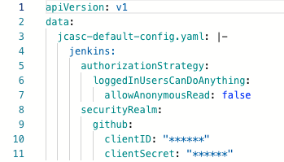
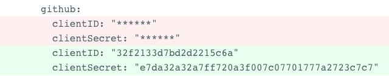

## masking-proxy
:warning: **Experimental**

masking-proxy creates an external Argo CD cluster that proxies connections to a Kubernetes API server in order to mask sensitive data out.

Some data, such as that in ConfigMaps can get leaked out in the ArgoCD UI through the **Live Manifest** or **DIFF**, which we wanted to mask out after the Kubernetes templates.

### Prerequisites
- Kubernetes 1.18+
- Argo CD

### Installation
``` bash
## clone repo
git clone git@github.com:mziyabo/masking-proxy.git
cd masking-proxy

## install the masking-proxy helm chart
helm install --name masking-proxy ./chart/
```

After the install, an Argo CD cluster should be added under `Settings/Clusters` in the UI:


### Example

Inspect `proxy.conf.json` in the [configmap](./chart/templates/configmap.yaml) to either add or remove masking rules before running below:

``` bash
cat << EOF | kubectl apply -f -
apiVersion: argoproj.io/v1alpha1
kind: Application
metadata:
  name: sample
  namespace: argocd
spec:
  destination:
    namespace: sample
    server: https://masking-proxy.argocd.svc.cluster.local
  project: default
  source:
    path: examples/app
    repoURL: https://github.com/mziyabo/masking-proxy
    targetRevision: HEAD
  syncPolicy:
    syncOptions:
    - CreateNamespace=true
EOF
```

Note we create an application with the `server` property pointing to the `masking-proxy` cluster.

Check the `Argo CD` UI and the configmap will have masked out the regex pattern in the `proxy.conf.json` i.e. `(client(_?Secret|ID)):((\\s?\\\\+\"?)([a-z0-9]*)(\\\\\"|\"|\\s)?)`

The pattern matches GitHub OAUTH client details:

**Live Manifest:**



**DIFF:**



### Configuration

Proxy configuration is via [proxy.conf.json](./proxy.conf.json) which is mounted into the pods via a ConfigMap. 

**Config Properties**

|Parameter|Description|Default|
|---------|-----------|-------|
|`serve.port`|Proxy port|`3003`|
|`serve.host`||Empty String|
|`serve.tls.enabled`|Enable proxy SSL endpoint|`true`|
|`serve.tls.cert`|Proxy Cert||
|`serve.tls.certKey`|Proxy Cert Key||
|`target`|Kubernetes API Server being proxied|`https://kubernetes.default.svc`|
|`rules.id`|Matching rule id||
|`rules.name`|Matching rule name||
|`rules.description`|Matching rule description||
|`rules.pattern`|Regex pattern to match||
|`rules.replacement`|Masking string we'll use to replace the pattern based off matched regex groups||

### Limitations
- The proxy doesn't mask the `Desired Manifest` or `DIFF` in the UI details. The workarounds are to either use something like [argocd-vault-plugin](https://github.com/argoproj-labs/argocd-vault-plugin) OR changing tack and masking from UI middleware instead.

### Release Notes
This program is Experimental.

### License
Apache-2.0