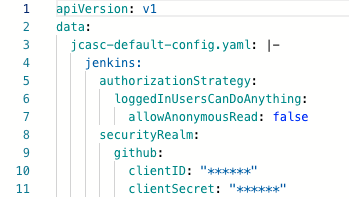

## masking-proxy
:warning: **Experimental**

`masking-proxy` is an Argo CD Kubernetes cluster that proxies connections to the default server to mask sensitive data out.

### Prerequisites

- Kubernetes 1.18+
- Argo CD

### Installation

``` bash
## Clone repo
git clone git@github.com:mziyabo/masking-proxy.git
cd masking-proxy

## Install the masking-proxy helm chart
helm install --name masking-proxy ./chart/
```

After the helm install, an Argo CD cluster will be added under `Settings/Clusters` in the UI:


### Configuration

|Parameter|Description|Default|
|---------|-----------|-------|
|`argocd.maskingProxyCluster.config`|`{\"tlsClientConfig\":{\"insecure\":true}}`|
|`argocd.maskingProxyCluster.name`|Argo CD cluster name for masking-proxy|`masking-proxy`|
|`argocd.maskingProxyCluster.server`|Argo CD server address||


### Example

Inspect `proxy.conf.json` in the [configmap](./templates/configmap.yaml) to either add or remove masking rules before running below:

``` bash
cat << EOF | kubectl apply -f -
apiVersion: argoproj.io/v1alpha1
kind: Application
metadata:
  name: sample
  namespace: argocd
spec:
  destination:
    namespace: sample
    server: https://masking-proxy.argocd.svc.cluster.local
  project: default
  source:
    path: examples/app
    repoURL: https://github.com/mziyabo/masking-proxy
    targetRevision: HEAD
  syncPolicy:
    syncOptions:
    - CreateNamespace=true
EOF
```

Note we create an application with the `server` property pointing to the `masking-proxy` cluster.

Check the `Argo CD` UI and the configmap will have masked out the regex pattern in the `proxy.conf.json` i.e. `(client(_?Secret|ID)):((\\s?\\\\+\"?)([a-z0-9]*)(\\\\\"|\"|\\s)?)`

The pattern matches GitHub OAUTH client details:

**Live Manifest:**



**DIFF:**
